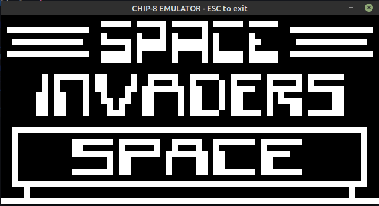

# Chip-8 emulator in Rust



This was one of the coolest projects that I ever coded, so if you are thinking in coding your own emulator, go ahead, it is really Fun!

### Usage

```
cargo run ./games/path_to_file --release
```
### Keys

 |1| |2| |3| |4|

 |Q| |W| |E| |R|

 |A| |S| |D| |F|

 |Z| |X| |C| |V|


### Resources 

<a href="http://devernay.free.fr/hacks/chip8/C8TECH10.HTM"> Cowgod's Chip-8 Technical Reference </a>

<a href="http://www.multigesture.net/articles/how-to-write-an-emulator-chip-8-interpreter">How to write an emulator (CHIP-8 interpreter) <a/>
  
 ### References
   I used the minifb and time crates, to build the screen and to control the speed of the emulation respectively. Also I used <a href="https://github.com/JamesGriffin/CHIP-8-Emulator">JamesGriffin</a> emulator as reference
